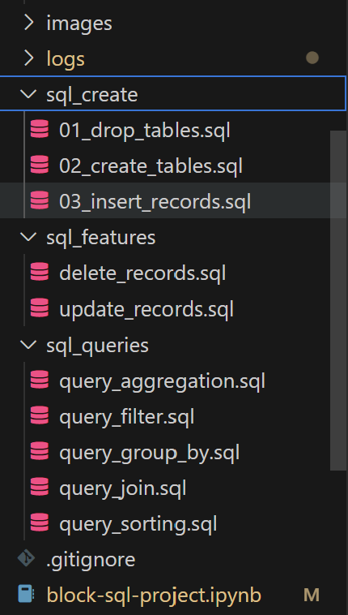
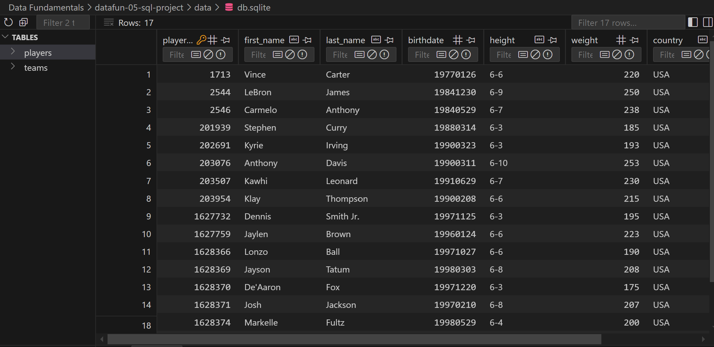
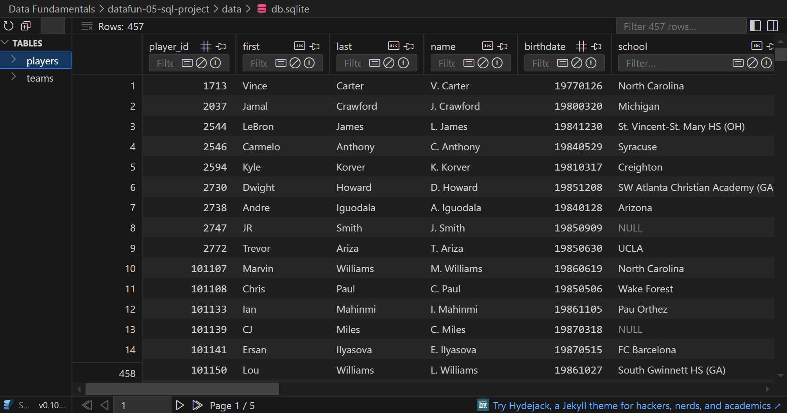
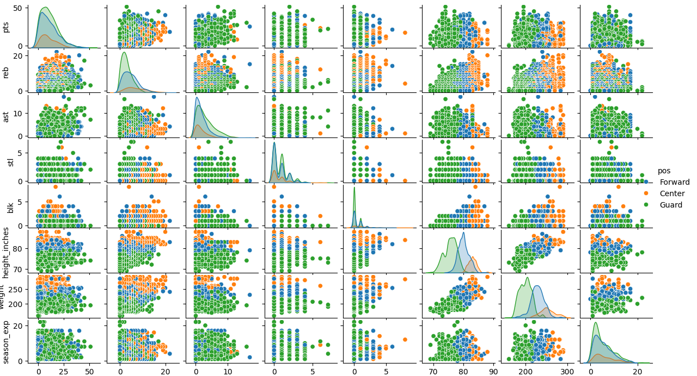

# datafun-05-sql-project
Created for P5 of Data Fundamentals Course

## Description
This project demonstrates the creation of a SQL database using Python and SQLite3 and some NBA statistics datasets. Jupyter Notebook is used to demonstrate exploratory data analysis of the  dataset using SQLite3 and Pandas to manipulate the relational data from the database.

## How to Install & Run the Project
1. Create repository on GitHub with default README.md, Python .gitignore, and MIT license
2. Copy the repository to a local project folder:  
`git clone https://github.com/matthewpblock/datafun-05-sql-project`  
3. Migrate terminal to the project server
4. Setup a virtual environment:  
`py -m venv .venv`  
5. Activate the virtual environment:  
`.venv\Scripts\activate`  
6. Create requirements.txt
7. Commit changes
8. Update pip & install requirements
```py -m pip install --upgrade pip setuptools wheel  py -m pip install -r requirements.txt```  
9. Set correct interpreter & kernel  

## Folder Structure
- sql_create: Contains SQL scripts to drop and create tables (including foreign keys), and insert records to a table
- sql_features: Contains SQL scripts for data cleaning and feature engineering
- sql_queries: Contains various SQL scripts for aggregation statistics, filtering, sorting, grouping, and joining data
- data: contains source data CSVs, the SQL database, and any outputs
- logs: contains logs of scripted actions ran and errors


## Files
- db01setup.py  
  '''py db01_setup.py'''
  - establishes a four-table database of NBA data for the 2019-2020 season.
  - It begins by dropping established tables, so that the script can be re-ran as needed for multiple iterations. It also fills a limited amount of player and team data. 
  - Primary keys within the table are established to prevent duplication 
  - Foreign keys are established to tie the tables together as appropriate.

- db02_features   
'''py db02_features.py'''
  - Updates the tables with a much deeper set of data from CSV files provided in the data folder. 
  - Before loading the provided CSVs, any previously entered data is deleted to prevent duplication leading of data leading to primary key errors.
  - It also creates a new integer column 'height_inches' by converting heights from the feet-inches format in order to enable comparison calculations.

- db03_queries was designed to be run as an imported module with functions enabling pre-scripted SQL queries  
'''import db03_queries as queries'''
  - sorting_rim_protection() sorts the top rim-protecting game performances, printing the players with the most blocks in a game in the sample
  - group_by_team_avg_weight() displays the average weight of each team's roster
  - filter_bench() eliminates all game performances by starters, leaving only performances by players coming off the bench
  - aggregation() calculates the average height and weight of all league players in the database. Other queries are available for this function by changing with lines are commented in the query_aggregation.sql file in the sql_queries folder
  - join() combines data from various tables to show the performances with the most rebounds. This query could be used to chart how various characteristics correlate to rebounding performance. Columns include:
    - date
    - player name
    - pts
    - reb
    - ast
    - stl
    - blk
    - height
    - weight
    - seasons of experience
    - position


## References
- Lessson specifications: https://github.com/denisecase/datafun-05-spec  
- Data from: "Learn to Code with Basketball" by Nathan Braun https://github.com/nathanbraun/code-basketball-files

